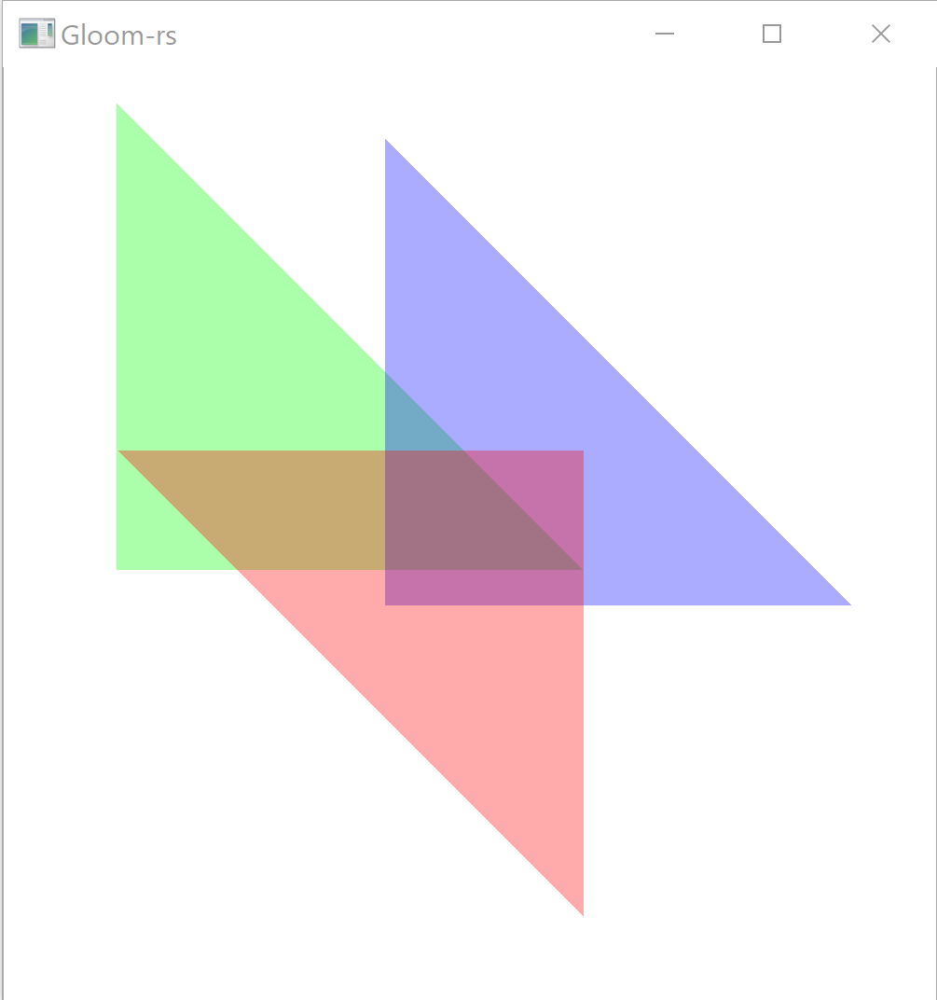
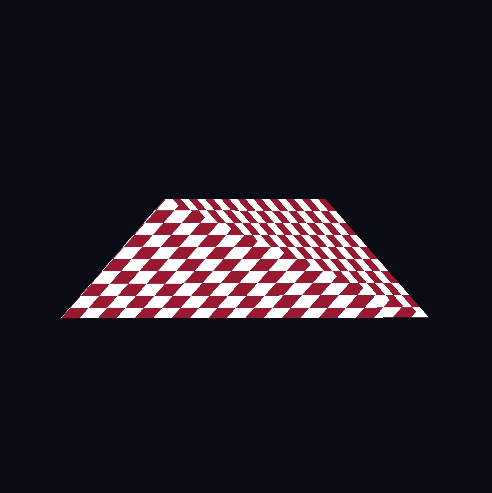

---
# This is a YAML preamble, defining pandoc meta-variables.
# Reference: https://pandoc.org/MANUAL.html#variables
# Change them as you see fit.
title: TDT4195 Exercise 2
author:
- Jonas Joshua Costa
- Noé Hirschauer
date: \today # This is a latex command, ignored for HTML output
lang: en-US
papersize: a4
geometry: margin=2cm
toc: false
toc-title: "Table of Contents"
toc-depth: 2
numbersections: true
header-includes:
# The `atkinson` font, requires 'texlive-fontsextra' on arch or the 'atkinson' CTAN package
# Uncomment this line to enable:
- '`\usepackage[sfdefault]{atkinson}`{=latex}'
colorlinks: true
links-as-notes: true
# The document is following this break is written using "Markdown" syntax
---

# Task 1b


OpenGL makes use of barycentric interpolation which, in simple terms, simply computes a weighted sum of all three color values with the distances from the fragement to the vertices being the weight. [SO](https://stackoverflow.com/questions/13210998/opengl-colour-interpolation13211355) [Wikipedia](https://en.wikipedia.org/wiki/Barycentric_coordinate_system#Barycentric_coordinates_on_triangles)

# Task 2
In this task we will focus on 3 overlapping triangles with different colors and a given transparency. The triangles are in different $z$ planes. 

## Task 2a

First, we make sure that the triangles are drawn back to front. In our case, the order is **red** $\rightarrow$ **green** $\rightarrow$ **blue** as shown in the picture below:


The colors of the triangles are :
- pure red `(1,0,0)`, 33% transparency
- pure green `(0,1,0)`, 33% transparency
- pure blue `(0,0,1)`, 33% transparency
  
The part where the triangles overlap is mostly blue, which is the color of the closest triangle (last one being drawn).

## Task 2b

Now we will swap the color of the triangles. The $z$ position and the drawing order of the triangles remains the same, only the color changes.
  
- **red** $\rightarrow$ **blue** $\rightarrow$ **green**  
    
  In this case, the overlapping area is mostly green
- **green** $\rightarrow$ **blue** $\rightarrow$ **red**  
    
  In this case, the overlapping area is mostly red

These are expected results considering how OpenGL computes the color with alpha blending:

$$\mathrm{Color_{new}}=\alpha_\mathrm{source}\times \mathrm{Color_{source}} + (1-\alpha_\mathrm{source})\times \mathrm{Color_{destination}}$$

Here, we have the source alpha set to 33% so, on a pure white background, the color of a triangle will be white + some color which is why the triangles look very light.

In the places where they overlap, the destination color is the mix of white and color mentionned above, which will be added to the new source color. For example, in the area where red and blue overlap in the last image, there is a pure blue with 33% transparency added to a light green area which results in a cyan-blue color.

## Task 2c

Now, we will change the $z$ coordinate of the triangles without changing the color or the order that they are being drawn.

- $\textcolor{red}{\textbf{back}} \rightarrow \textcolor{green}{\textbf{front}} \rightarrow \textcolor{blue}{\textbf{middle}}$  
    
  
  Here, the green triangle is drawn before the blue one. The depth buffer detects that the green triangle is closer to the camera and does not render the part of the blue triangle that is behind it.
  
  It still renders the red triangle because it has been drawn before so the depth test is not executed on this one.

- $\textcolor{red}{\textbf{front}} \rightarrow \textcolor{green}{\textbf{back}} \rightarrow \textcolor{blue}{\textbf{middle}}$  
    
  
  Here the red triangle is drawn first and positionned the closest to the camera so anything that is behind it is not rendered thanks to the depth buffer.  

  The green triangle is positionned in the back so it does not affect the blue one that is closer but drawn after.  
 

# Task 3

For the rest of **Task 3** the transformations will be compared to the following reference image:


## Task 3a

It is possible to multiply each vertex by a matrix using the vertex shader:

```glsl
in vec4 position;

void main()
{
    mat4 A = mat4(
        1, 1, 0, 0,
        0, 0.5, 0, 0,
        0, 0, 1, 0,
        0, 0, 0, 1
    );
    gl_Position = A*position;
}
```
The output vertices result in the following image:


## Task 3b

In this section we will study the impact of modifying one of $a,b,c,d,e,f$ in the following affine transformation matrix:

$$
A = \begin{bmatrix}
a&b&0&c\\
d&e&0&f\\
0&0&1&0\\
0&0&0&1
\end{bmatrix}
$$

To better see the effect of changing only one variable (starting from the identity matrix), we will use a uniform variable oscillating between -1 and 1.

- $a$ and $e$ impacts the scaling of the $x$ anf $y$ coordinate respectively as shown below. It should be noted that having a negative value flips the projection plane.
  


*$a$ : x scaling*


*$e$ : y scaling*

- $b$ and $d$ correspond to shear along the $x$ and $y$ axis respectively 


*$b$ : shearing along x*


*$d$ : shearing along y*

- $c$ and $f$ correspond to translations along the $x$ and $y$ axis respectively. It is the expected behavior of the trasform vector in the homogenous coordinates.


*$c$ : horizontal translation*


*$f$ : vertical translation*

## Task 3c

To define a rotation of the whole model, we need a rotation matrix such as $R_x$ for a rotation around the $x$ axis:

$$
R_x = \begin{bmatrix}
\cos\theta&-\sin\theta&0&0\\
\sin\theta&\cos\theta&0&0\\
0&0&1&0\\
0&0&0&1
\end{bmatrix}
$$

In a rotation matrix, there are 4 coordinates that need to be changed at the same time, unlike in **Task 3b** where only one value was changed. 

# Task 4

## Task 4a

Passing in a uniform matrix is pretty simple with our current setup. First, the image below shows how the RGB cube is rendered without any transformation apart from perspective transformation.


We add the following lines to our program:

```rust
// Calculate transformations
let mut test_matrix: Mat4x4 = glm::rotation(glm::pi(), &glm::vec3(0.0, 1.0, 0.0));
test_matrix = glm::translation(&glm::vec3(0.0,0.0,-2.0)) * test_matrix;
...
gl::UniformMatrix4fv(3, 1, gl::FALSE, test_matrix.as_ptr());
```

The following is added to the shader:

```glsl
uniform layout(location=3) mat4 transform;
...
vec4 new_position = position;
```

With that in place, we can see that the RGB cube is correctly rotated 180° on the y-axis.


## Task 4b

This task simply moves the perspective transformation into the main program loop instead of the shader. As a result, the code now looks slightly different:

```rust
let rotation_matrix: Mat4x4 = glm::rotation(glm::pi(), &glm::vec3(0.0, 1.0, 0.0));
let translate_matrix: Mat4x4 = glm::translation(&glm::vec3(0.0,0.0,-3.0));
let perspective_matrix: Mat4x4 = glm::perspective(window_aspect_ratio, glm::half_pi(), 1.0, 100.0);
let transform_matrix = perspective_matrix * translate_matrix * rotation_matrix;
...
gl::UniformMatrix4fv(3, 1, gl::FALSE, transform_matrix.as_ptr());
```

As instructed, we make sure that the perspective is applied last.


## Task 4c: Keybinds

|Movement|Bind|
|-|-|
|Forward|`W`/`I`|
|Backward|`S`/`K`|
|Left|`A`/`J`|
|Right|`D`/`L`|
|Up|`Space`|
|Down|`Left Control`|
|Yaw|`←`/`→`|
|Pitch|`↑`/`↓`|

Note: The camera may also be controlled with a mouse or touchpad.

Note: Up and down movements are always absolute and not relative to the camera direction as that was deemed a bit disorienting.

# Task 5

## Task 5a

In order to make the camera move in the direction that it's looking at something like this does the trick:

```rust
D | L => {
    camera_position += (inverse_rotation_matrix
        * (x_axis.to_homogeneous() * delta_speed))
        .xyz()
}
```

This is repeated for every direction. While the same thing could be done with vertical movement, we chose not to as it feels a bit disorienting.

(`inverse_rotation_matrix` is just the rotation matrix built from the mouse vector * -1)

## Task 5b

Here we focus on the effect of diifferent interpolation methods, namely `smooth` and `noperspective`. To show their effect we are going to use a square composed of 2 triangles lying flat "on the ground" ($y=0$).

Smooth interpolation follows perspective transform, as shown in the picture below:


Here the checkerboard lines follow the expected geometry across the whole plane, so their apparent angle changes along the $x$ axis.

When `noperspective` is used, the pattern is only computed once based on a single vertex so the angle will be the same for the whole triangle:



In this image we can see that the "horizontal" and "vertical" lines are all parallel in each triangle but with reference to different edges, creating a strange warping motion when the camera is moving.

To achieve this effect, we added an output to the vertex shader :
```glsl
out vec4 vert_position;
...
vec4 new_position = transform * position;
vert_position = new_position;
```

This can then be used as input in the fragment shader to draw the checkerboard pattern (remove `noperspective` for smooth interpolation):

```glsl
in noperspective vec4 vert_position;
...
// Checkerboard
int size = 5;
bool pattern = (mod(floor(vert_position.x*size),2)
    ==mod(floor(vert_position.y*size),2));
    
color = (pattern) ? color_1 : color_2;
```


## Task 5d

In this part we discuss wether or not the following transformations are possible using a single 4x4 matrix.

### I


This is easily achievable using shear along $x$ and $y$ in the $(x,y)$ plane:
```glsl
mat4 shearMatrix = mat4(
    1.0, a, 0.0, 0.0,
    b, 1.0, 0.0, 0.0,
    0.0, 0.0, 1.0, 0.0,
    0.0, 0.0, 0.0, 1.0
);
``` 

### II


This is not possible under the assumption that the points all lie in the same plane.

If we are allowed to place the points in different $z$ planes, then it can be done using perspective transform and putting the points in the top left and right corner (green) at a very far $z$, the intermediate ones (blue) a bit closer and the rest (red) stay at $z=0$.

The perspective transform is a 4x4 matrix that will bring the points further from the camera closer to the center of the screen, achieving the transformation in the picture.


### III


First we apply a rotation matrix some degrees around the x-axis. Then, we apply a perspective transformation matrix.

Alternatively, we can can just move the upper to vertices back along the z-axis and apply a perspective transformation matrix.

### IV


This is only possible if the 2 squares are in different $z$ planes. Then we can use shearing along the $x$ axis in the $(x,z)$ plane (s). This is a simple shearing matrix where $a$ needs to be adjusted depending on the distance between the planes:
```glsl
mat4 shearMatrix = mat4(
    1.0, 0.0, a, 0.0,
    0.0, 1.0, 0.0, 0.0,
    0.0, 0.0, 1.0, 0.0,
    0.0, 0.0, 0.0, 1.0
);
```

### V


Again, this is possible to achieve with different $z$ planes and the perspective matrix. The triangles get closer to the camera from left to right. Note that this is not a linear distribution along $z$, more like a quadratic distribution to achieve the "curved" effect in the image.