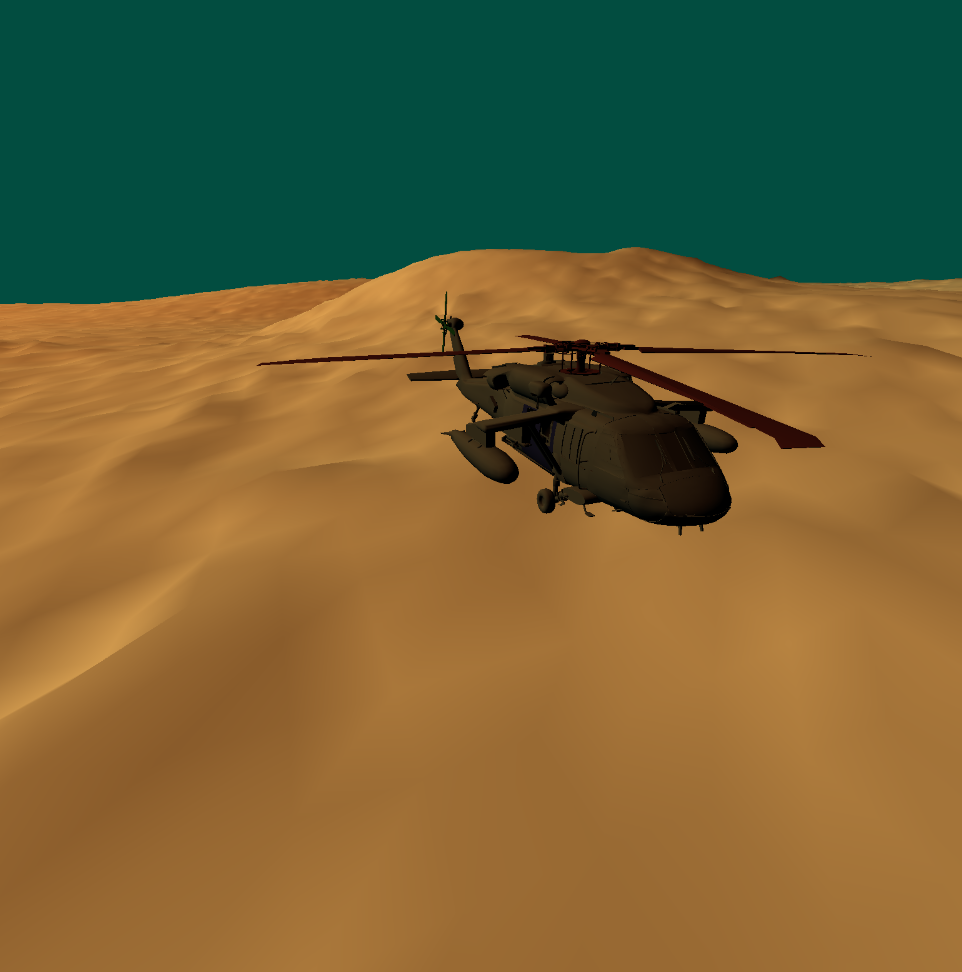

---
# This is a YAML preamble, defining pandoc meta-variables.
# Reference: https://pandoc.org/MANUAL.html#variables
# Change them as you see fit.
title: TDT4195 Exercise 2
author:
- Jonas Joshua Costa
- Noé Hirschauer
date: \today # This is a latex command, ignored for HTML output
lang: en-US
papersize: a4
geometry: margin=2cm
toc: false
toc-title: "Table of Contents"
toc-depth: 2
numbersections: true
header-includes:
# The `atkinson` font, requires 'texlive-fontsextra' on arch or the 'atkinson' CTAN package
# Uncomment this line to enable:
- '`\usepackage[sfdefault]{atkinson}`{=latex}'
colorlinks: true
links-as-notes: true
# The document is following this break is written using "Markdown" syntax
---

# Task 1

In this task we will focus on loading the terrain model and implement some simple lighting. We use the given `mesh.rs` file to extract the mesh from the `lunarsurface.obj` file.

We also modified our VAO generation function to add a new buffer of floats containing normals.

## Task 1c

Now that our VAO supports normals, we can get them in the vertex shader and pass them to the fragment shader to do implement lighting.

In the vertex shader:

```glsl
in layout(location = 5) vec3 normals;
out vec3 vert_normals;
...
vert_normals = normals;
```

First, we will visualize normals with the fragment shader by using the $x,y,z$ coordinates of the normals as the RGB component of the vertices :

```glsl
in vec3 vert_normals;
out vec4 color;
...
color = vec4(vert_normals.xyz,1.0);
```

Since most of the triangles are facing "up" (positive $y$) so the main color will be green as shown in the picture below.


## Task 1d

The image above is not exactly what one would expect the surface of the moon to look like. To finally get some correct shading, we will implement a simple lambertian lighting model. 

The basic idea is that we have a light source at a given position and we compute the vector corresponding to the direction of this light source for each fragment. We obtain a vector $v_\mathrm{light\,direction}$. The color of the fragment is then set to :

$$\mathrm{newcolor} = \mathrm{color_{RGB}} \times max(0,-v_\mathrm{normal}\cdot v_\mathrm{light\,direction})$$

In our shader we implemented a slightly more complex model with ambient lighting (base level of lighting) and a light color. Also, the light source is spinning above the camera so

```glsl
void main()
{
    // Light color and position (no alpha)
    vec3 light_pos = 100*vec3(cos(time/10.0),1, sin(time/10.0));
    vec3 light_color = vec3(0.9412, 0.7922, 0.7137);
    
    // Ambient lighting (base lighting for all faces)
    float ambientStrength = 0.2f;
    vec3 ambient = ambientStrength * light_color;
    
    // Diffuse lighting (lambertian model)
    vec3 light_dir = normalize(light_pos - vert_position.xyz);
    float diff = max(dot(vert_normals, light_dir), 0.0);
    vec3 diffuse = diff * light_color;

    color = vec4(vert_color.xyz * (ambient + diffuse), 1.0);
}
```

We end up with the following result:


# Task 2c
We constructed a scene graph that contains all the elements of the scene. The structure is shown in the figure below:


**mermaid code (might not work with pandoc)**


The `SceneNode` structure has the following properties:

- `position` where the node should be in relation to their parent
- `rotation` of the node relative their parent
- `scale` is quite explicit
- `reference_point` the point this node is supposed to scale and rotate around
- `vao_id` contains the vao of what should be drawn in this node
- `index_count` the number of vertices that should be drawn
- `children` contains all the scene node "below"

We can now recursively iterate over all nodes to get their transformations relative to their parents and draw the elements in the scene using the following function.

```rust
    unsafe fn draw_scene(
        &mut self,
        node: &SceneNode,
        view_projection_matrix: &Mat4x4,
        transformation_so_far: &Mat4x4,
    ) {
        // Determine the transformation matrix from the current state
        let new_matrix: Mat4x4 = transformation_so_far * node.get_transform_intrinsic();
        // Only draw if we have faces
        if node.index_count > 0 && node.node_type == NodeType::Mesh {
            gl::BindVertexArray(node.vao_id);
            match &self.shader {
                Some(shader) => {
                    // Pass matrices to our shaders
                    let transform_uniform = shader.get_uniform_location("transform");
                    gl::UniformMatrix4fv(transform_uniform, 1, gl::FALSE, new_matrix.as_ptr());
                    let view_uniform = shader.get_uniform_location("view_projection");
                    gl::UniformMatrix4fv(
                        view_uniform,
                        1,
                        gl::FALSE,
                        view_projection_matrix.as_ptr(),
                    );
                }
                None => {}
            }
            // Draw
            gl::DrawElements(
                gl::TRIANGLES,
                node.index_count,
                gl::UNSIGNED_INT,
                ptr::null(),
            );
        }
        // Recursive call
        for &child in &node.children {
            self.draw_scene(&*child, view_projection_matrix, &new_matrix);
        }
    }
```

We get the following scene


# Task 5

## Task 5a

There is something wrong about the lighting when the helicopter rotates around as shown in the images below




## Task 5c

We split the transform matrix into 2 parts that are passed as uniforms to the vertex shader:

- View projection matrix that transforms the vertex positions.
- Model matrix that is used to transform the vertex normals.

```glsl
in vec4 position;               // The vertex positions
uniform mat4 transform;         // Normals transformation matrix
uniform mat4 view_projection;   // View projection matrix

out vert_normals                // The updated normals
out vert_position               // The updated position
void main(){
        vert_normals = normalize(mat3(transform) * normals);
        vert_position = view_projection * transform * position;
        gl_Position =  vert_position;  
}
```
This allows us to use the corrected `vert_normals` and `vert_position` in the fragment shader to fix the lighting.

```glsl
void main()
{
    // Diffuse lighting (lambertian model)
    
    // Light color and position (fixed Sun)
    vec4 light_pos = vec4(1000,1000,500,1.0);
    vec3 light_color = vec3(0.9216, 0.4431, 0.1451);
    vec3 light_dir = normalize((light_pos - vert_position)).xyz;
    float diff_coeff = max(dot(vert_normals, light_dir), 0.0);
    vec3 diffuse = diff_coeff * light_color;

    color = vec4(vert_color.xyz * diffuse, 1.0);
}
```


# Task 6


# Bonus Tasks

## Bonus a
Here we focus on implementing the Phong shading model. It consists of 3 parts :

- ambient lighting (base light level when there is no light source)
- lambertian diffuse lighting just as before
- specular lighting depends on the angle between the camera and the light source

We already have everything that we need in the fragment shader for the ambient and lambertian parts but we need to pass the camera position as a uniform to do the specular reflection.

The final fragment shader looks like this :
```glsl
void main()
{
    // ambient lighting
    vec3 ambient_color = vec3(0.9216, 0.4431, 0.1451);
    float ambient_coeff = 0.2;
    vec3 ambient = ambient_coeff * ambient_color;
        
    // Lambertian lighting
    //vec4 light_pos = heli_position + heli_yaw * vec4(0.0,10.0,20.0,1.0);
    vec4 light_pos = vec4(100,100,100,1.0);
    vec3 light_color = vec3(0.0588, 0.5608, 0.6804) * 0.9;
    vec3 light_dir = normalize((light_pos - vert_new_position)).xyz;
    float diff_coeff = max(dot(vert_normals, light_dir), 0.0);
    vec3 diffuse = diff_coeff * light_color;

    // Specular lighting (Phong's model)
    vec3 view_dir = normalize(camera_position.xyz-vert_new_position.xyz);
    vec3 halfway_dir = normalize(light_dir + view_dir);
    int shininess = 1000;
    float spec = pow(max(dot(vert_normals, halfway_dir), 0.0), shininess);
    vec3 specular_color = vec3(1.0, 1.0, 1.0);
    vec3 specular = spec * specular_color;

    color = vec4(vert_color.xyz * (diffuse+ambient+specular), 1.0);
}
```

In the specular lighing part we calculate the angle between the camera and the vertex position `view_dir`. This value is then used to calculate the halfway direction between the light direction and the view direction. This is the direction along which the "light will be reflected".

As we didn't have any material values for the terrain or the helicopter we just defined a fixed shininess that controls how concentrated the specular reflection is on all surfaces. Higher values lead to intense but condensed reflections.


## Bonus b/c

Making the helicopter controllable was suprisingly simple. We just have to apply the movement that's calculated for the camera to the helicopter instead. The scene graph takes care of the rest.

Making it nice was *significantly* more difficult, though. Instead of just adding a fixed value, we replaced the movement system with rudimentary momentum based one. Pressing keys simply accelerates the speed vector which is then passed into another function, along with some other info, to produce the helicopter's next position. We also made the camera rotate around the helicopter. When no keys are pressed, the helicopter decelerates until it reaches a standstill.

## Bonus d

We didn't do this one.

## Bonus e

To make the helicopter more visually appealing, we changed the animation function to also output pitch, yaw, roll. This is where we finally ran into issues with extrinsic angles. This lead us to ~~a lot of frustration~~ refactor a few parts of the code. In the end, we ended up with a setup that works with camera, movement, and animations.

## Bonus f


## Bonus g

We implemented really simple fog in the fragment shader. We also added some curvature to the surface to make it look at least a little like a small planet. There's no gravity though!

