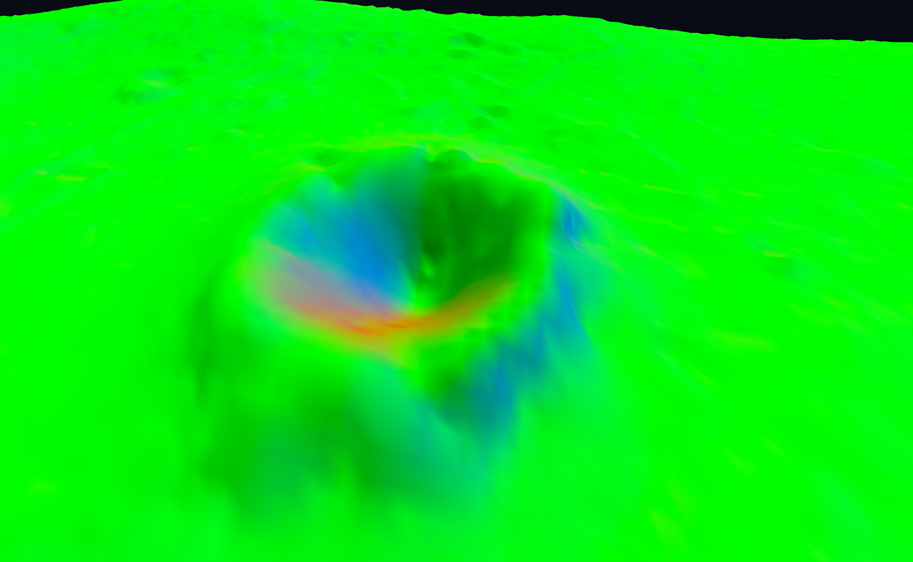

---
# This is a YAML preamble, defining pandoc meta-variables.
# Reference: https://pandoc.org/MANUAL.html#variables
# Change them as you see fit.
title: TDT4195 Exercise 2
author:
- Jonas Joshua Costa
- Noé Hirschauer
date: \today # This is a latex command, ignored for HTML output
lang: en-US
papersize: a4
geometry: margin=2cm
toc: false
toc-title: "Table of Contents"
toc-depth: 2
numbersections: true
header-includes:
# The `atkinson` font, requires 'texlive-fontsextra' on arch or the 'atkinson' CTAN package
# Uncomment this line to enable:
- '`\usepackage[sfdefault]{atkinson}`{=latex}'
colorlinks: true
links-as-notes: true
# The document is following this break is written using "Markdown" syntax
---

# Task 1

In this task we will focus on loading the terrain model and implement some simple lighting. We use the given `mesh.rs` file to extract the mesh from the `lunarsurface.obj` file.

We also modified our VAO generation function to add a new buffer of floats containing normals.

## Task 1c

Now that our VAO supports normals, we can get them in the vertex shader and pass them to the fragment shader to do implement lighting.

In the vertex shader:

```glsl
in layout(location = 5) vec3 normals;
out vec3 vert_normals;
...
vert_normals = normals;
```

First, we will visualize normals with the fragment shader by using the $x,y,z$ coordinates of the normals as the RGB component of the vertices :

```glsl
in vec3 vert_normals;
out vec4 color;
...
color = vec4(vert_normals.xyz,1.0);
```

Since most of the triangles are facing "up" (positive $y$) so the main color will be green as shown in the picture below.



## Task 1d

The image above is not exactly what one would expect the surface of the moon to look like. To finally get some correct shading, we will implement a simple lambertian lighting model. 

The basic idea is that we have a light source at a given position and we compute the vector corresponding to the direction of this light source for each fragment. We obtain a vector $v_\mathrm{light\,direction}$. The color of the fragment is then set to :

$$\mathrm{newcolor} = \mathrm{color_{RGB}} \times max(0,-v_\mathrm{normal}\cdot v_\mathrm{light\,direction})$$

In our shader we implemented a slightly more complex model with ambient lighting (base level of lighting) and a light color. Also, the light source is spinning above the camera so

```glsl
void main()
{
    // Light color and position (no alpha)
    vec3 light_pos = 100*vec3(cos(time/10.0),1, sin(time/10.0));
    vec3 light_color = vec3(0.9412, 0.7922, 0.7137);
    
    // Ambient lighting (base lighting for all faces)
    float ambientStrength = 0.2f;
    vec3 ambient = ambientStrength * light_color;
    
    // Diffuse lighting (lambertian model)
    vec3 light_dir = normalize(light_pos - vert_position.xyz);
    float diff = max(dot(vert_normals, light_dir), 0.0);
    vec3 diffuse = diff * light_color;

    color = vec4(vert_color.xyz * (ambient + diffuse), 1.0);
}
```

We end up with the following result:


