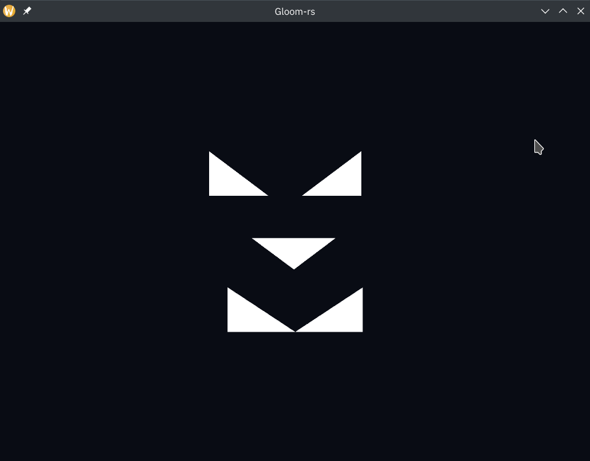
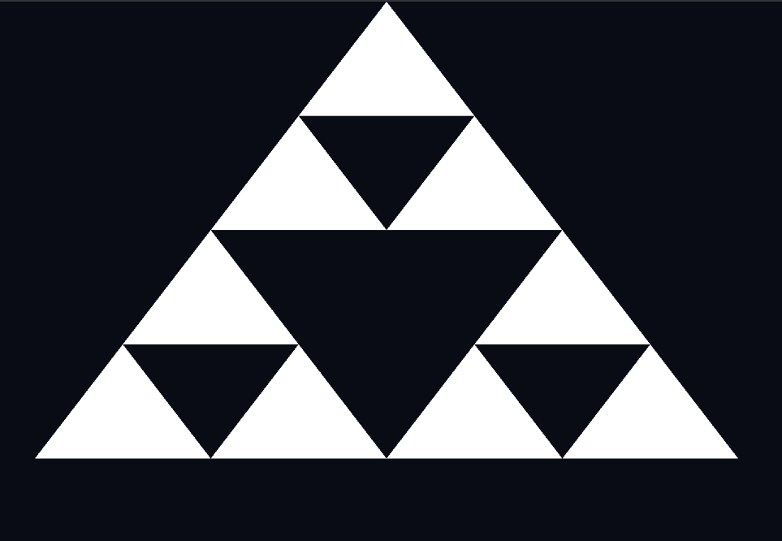
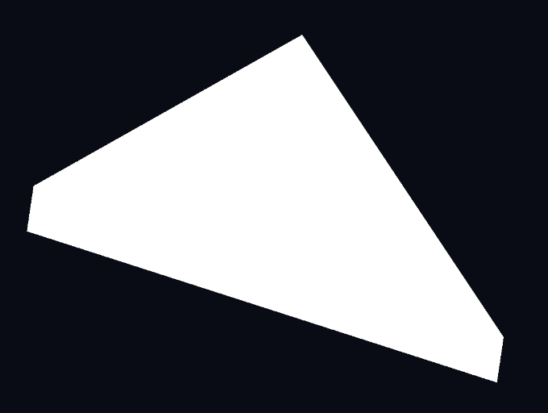
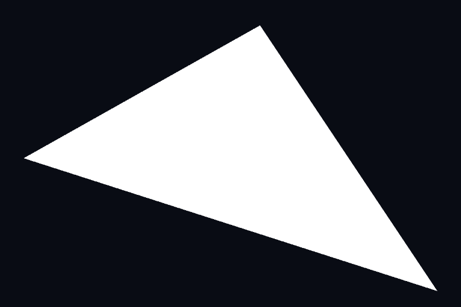
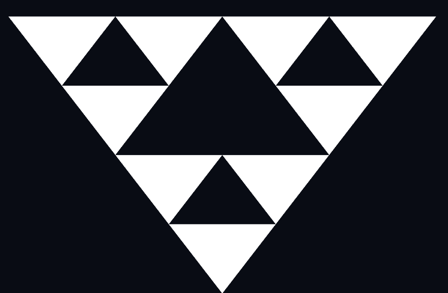
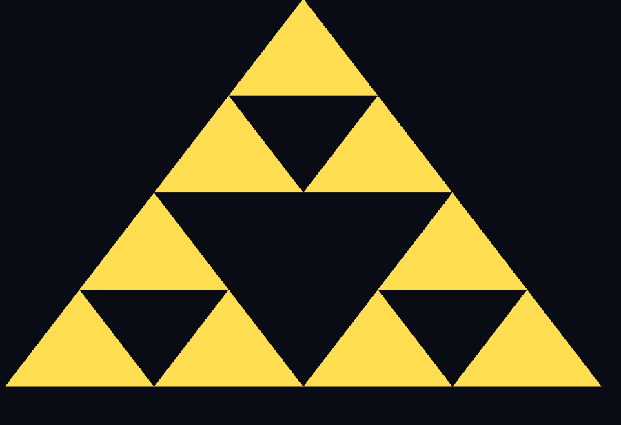
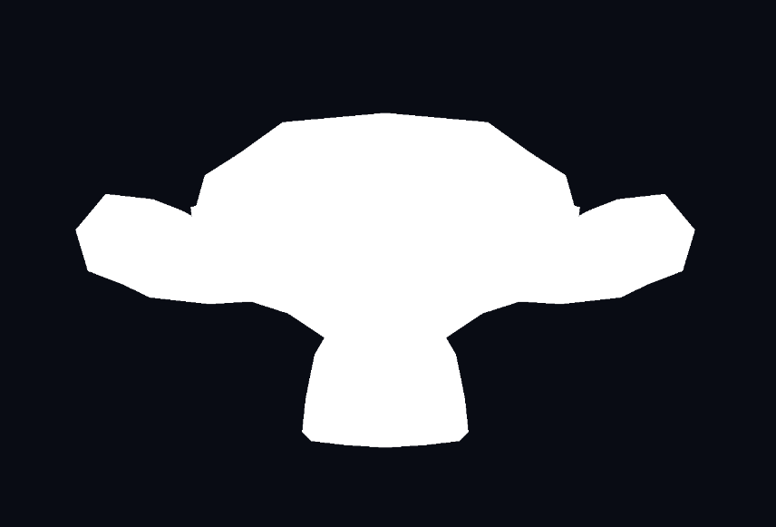
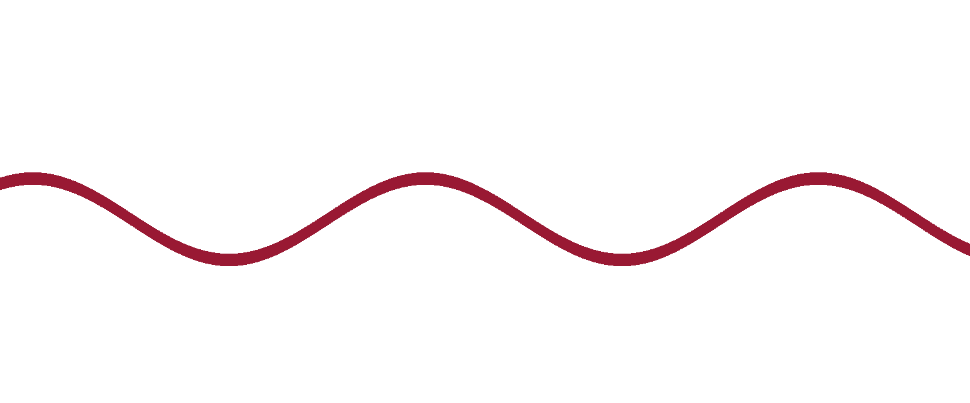

---
# This is a YAML preamble, defining pandoc meta-variables.
# Reference: https://pandoc.org/MANUAL.html#variables
# Change them as you see fit.
title: TDT4195 Exercise 1
author:
- Jonas Joshua Costa
- Noé Hirschauer
date: \today # This is a latex command, ignored for HTML output
lang: en-US
papersize: a4
geometry: margin=4cm
toc: false
toc-title: "Table of Contents"
toc-depth: 2
numbersections: true
header-includes:
# The `atkinson` font, requires 'texlive-fontsextra' on arch or the 'atkinson' CTAN package
# Uncomment this line to enable:
- '`\usepackage[sfdefault]{atkinson}`{=latex}'
colorlinks: true
links-as-notes: true
# The document is following this break is written using "Markdown" syntax
---

<!--
This is a HTML-style comment, not visible in the final PDF.
-->

# Task 1c

After implementing the VAO function and correctly wiring up the shaders, we were able to produce the images below with triangles.





# Task 2a



In the image above we can see that the triangle was **clipped** by OpenGL. In this case, the model is clipped to fit within -1 and 1 in all directions. Without clipping, OpenGL would try to render the whole scene even if it would not be visible in the final product. As a result, clipping improves performance in many cases.

Adjusting the offending vertices fixes the triangle as demonstrated below.



# Task 2b

In most cases, the triangle simply does not show up in the final image. This the result of face culling which selectively renders one side of the triangle, usually the front. The front is determined by the order of vertices. A counter-clockwise arrangement indicates that we're looking at the front of the face. Examples:

0 --> 1 --> 2  
1 --> 2 --> 0  
2 --> 1 --> 0

Earlier in the given code, we can see the following line of code:

```rust
gl::Enable(gl::CULL_FACE);
```

If we remove this line any arrangement of indices renders just fine.

# Task 2c

## Question 1

*Why does the depth buffer need to be reset each frame?*

The buffer must cleared in scenes where something can move as the buffer would otherwise contain invalid data from the previous frame. As a result the buffer is always filled with the value that signifies the farthest distance.

## Question 2

*In which situation can the Fragment Shader be executed multiple times for the same pixel? (Assume we do not use multisampling.)*

When two objects overlap, the fragment shader is fully applied to all pixels of the first object, then to all pixels of the second one. This may or may not discard the previously calculated pixel.

## Question 3

*What are the two most commonly used types of Shaders? What are the responsibilities of each of them?*

The most common types of shaders are:

- **Vertex shaders**  
Modify existing geometry to achieve effects such as perspective.
- **Fragment shaders**  
Define the color of each pixel.
- **Geometry shader**  
Unlike the vertex shader, the geometry shader may emit any number of vertices.
- **Compute shader**  
General purpose calculations that run on the GPU.

## Question 4

*Why is it common to use an index buffer to specify which vertices should be connected into triangles, as opposed to relying on the order in which the vertices are specified in the vertex buffer(s)?*

It allows to re-use the same vertex multiple times without having to copy the 3 coordinates, thus saving memory.

## Question 5

*While the last input of `gl::VertexAttribPointer()` is a pointer, we usually pass in a null pointer. Describe a situation in which you would pass a non-zero value into this function.*

If loading not just the coordinates into our buffer but also the UV coordinates we would need to tell OpenGL how many bytes it has to cross until a new set of numbers begins. Example: 3D coordinates + 2D UV coordinates results in $3 * 4 + 2 * 4 = 20$ Bytes.

# Task 2d








To achieve the flipping, we simply invert the X and Y components of our vertices and write the result back to `gl_Position`:

```glsl
gl_Position = vec4(position.x * -1.0f, position.y * -1.0f, position.z, 1.0f);
```

To recolor the mesh, we set the color output to our desired color. (yellow)

```glsl
in vec3 position;
void main()
{
    gl_Position = vec4(position.x * -1.0f, position.y * -1.0f, position.z, 1.0f);
}
```

# Task 3a: Checkerboard

In order to render a checkerboard pattern, we have to determine if a pixel is in an even or odd part of the pattern. We defined a `size` variable corresponding to the number of pixels in each square of the checkerboard, as well as 2 colors. The evenness of a pixel is determined using the expression below.

```glsl
int condition = int(mod(floor(gl_FragCoord.x/size),2)==mod(floor(gl_FragCoord.y/size),2));
```

First, we check wether a pixel is in an even or odd square along the x-axis by using `mod(gl_FragCoord.x/size),2)` and similarly along the y-axis. The `floor()` is added to remove the 0.5 in the coordinates since they are pixel centered. Both parts are then multiplied to get a 1 if they are even/odd and a 0 otherwise. This value can then be used to pick a color :

```glsl
color = condition*color_1+(1-condition)*color_2;
```

# Task 3b: Circle

To draw a circle we need to check wether the pixels are within a given radius $r$ of a given point $(c_x,c_y)$ which is the center of the circle :

$$
(x-c_x)^2+(y-c_y)^2\leq r^2
$$

This equation is then implemented in the fragment shader :

```glsl
int condition = int((gl_FragCoord.x-centerX)*(gl_FragCoord.x-centerX)
    + (gl_FragCoord.y-centerY)*(gl_FragCoord.y-centerY) < size*size);
```

The color can then be set using the same equation as the **Task 3a**


# Task 3c: Spiral

magic


# Task 3d: Color change

In order to have a shape change color over time we need to use a uniform variable that is updated in the main rendering loop. To do that, we need to assign a location and a name. In the preamble of the fragment shader we add :

```glsl
uniform layout(location=1) float time;
```

This uniform variable is updated in the main rendering loop by adding `delta_t` at each iteration:
```rust
unsafe {
    time += delta_t;
    gl::Uniform1f(1, time);
    }
```
This value can then be used to have the color smoothly changing between two colors :

```glsl
float condition = (1.0+sin(time)) / 2.0f;
color = condition*color_1+(1-condition)*color_2;
```

# Task 3e: Fragment abuse

We weren't able to figure this one out, sorry.

# Task 3f: .obj parsing

The Wavefront `.obj` file format is briefly described [on Wikipedia](https://en.wikipedia.org/wiki/Wavefront_.obj_file) and fully documented [here](https://paulbourke.net/dataformats/obj/). For our current needs, only some of the most important attributes are read. The enum at [src/obj_parser.rs:15](../src/obj_parser.rs#L15) lists all implemented attributes.

The parsing results are available immediately after construction. An additional type `Face` was implemented to hold data about faces. Some helper functions are available on the object to simplify usage of the data within.

In terms of code quality, the class is somewhat lacking due to our inexperience in working with Rust codebases. There is some code duplication present and likely some anti-patterns as well. Nevertheless, after throwing a bunch of 3D models at the parser, it seems to hold up well. The only limitation is that we currently cannot draw anything other that triangles, so no free-form geometry. How, we've already laid the groundwork to support loading normal and texture information which will hopefully turn out to be useful soon.



# Task 3g: Sine

The formula below demonstrates how the sine wave is calculated.

$$
\lfloor y_f < (y_\text{offset} + \sin{(t)} * A * \sin{(f * x_f + t)}) \rfloor * \\
 \lfloor y_f > (y_\text{offset} + \sin{(t)} * A * \sin{(f * x_f + t)} - \text{thickness}) \rfloor
$$

```glsl
int condition = 
int(gl_FragCoord.y<(positionY+sin(time)*amplitude*sin(frequency*gl_FragCoord.x+time)))
* int(gl_FragCoord.y>(positionY+sin(time)*amplitude*sin(frequency*gl_FragCoord.x+time)-thickness));
```

Everything below `positionY` is assumed to be the secondary color. Then, everything below `positionY - thickness` is assumed to be the primary color again. Now the amplitude is multiplied by the sine of the frequency times the x coordinate. This already results in a sine wave. By adding time to the equation, we can also make it move.

